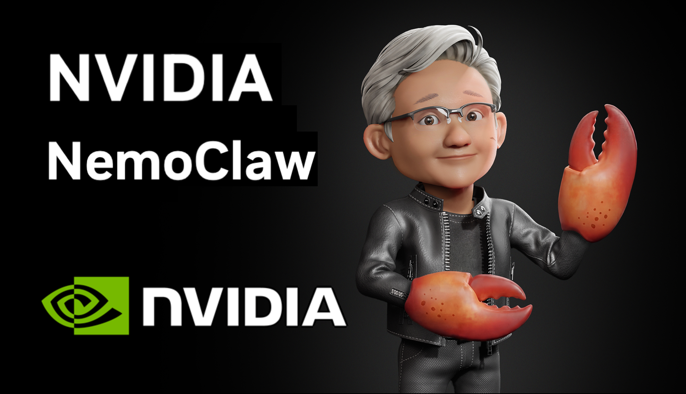
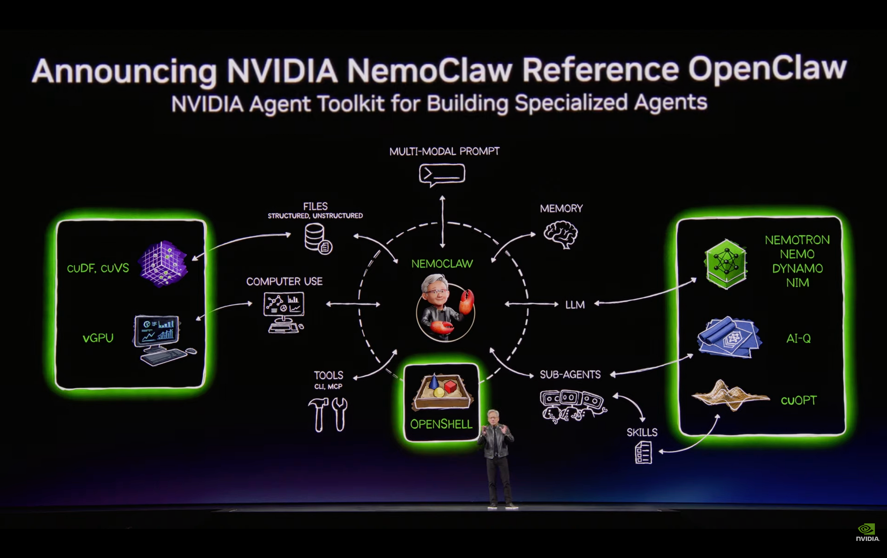
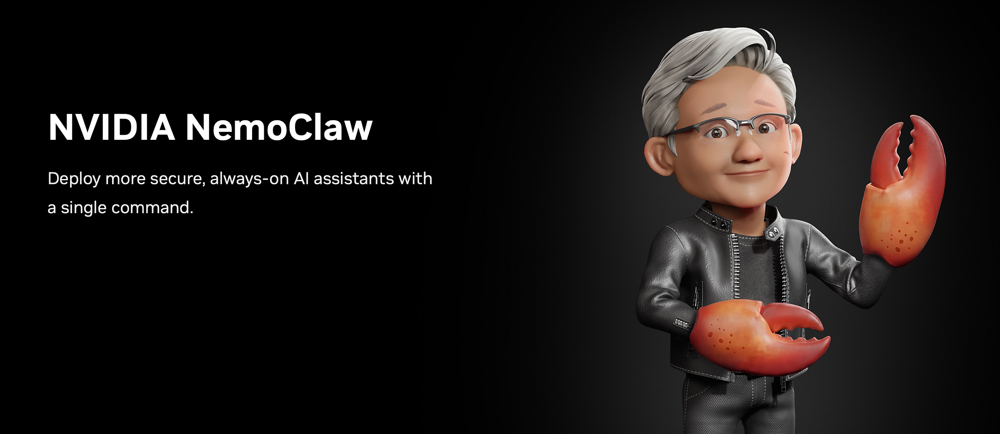
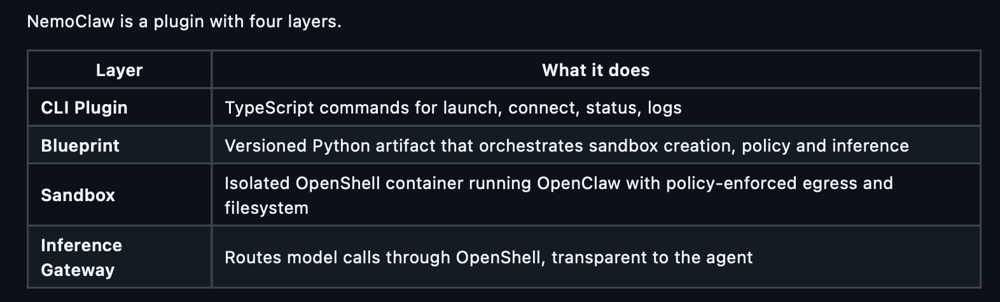
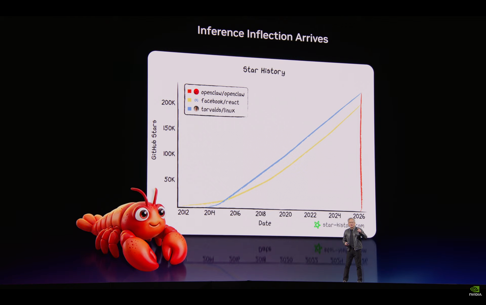
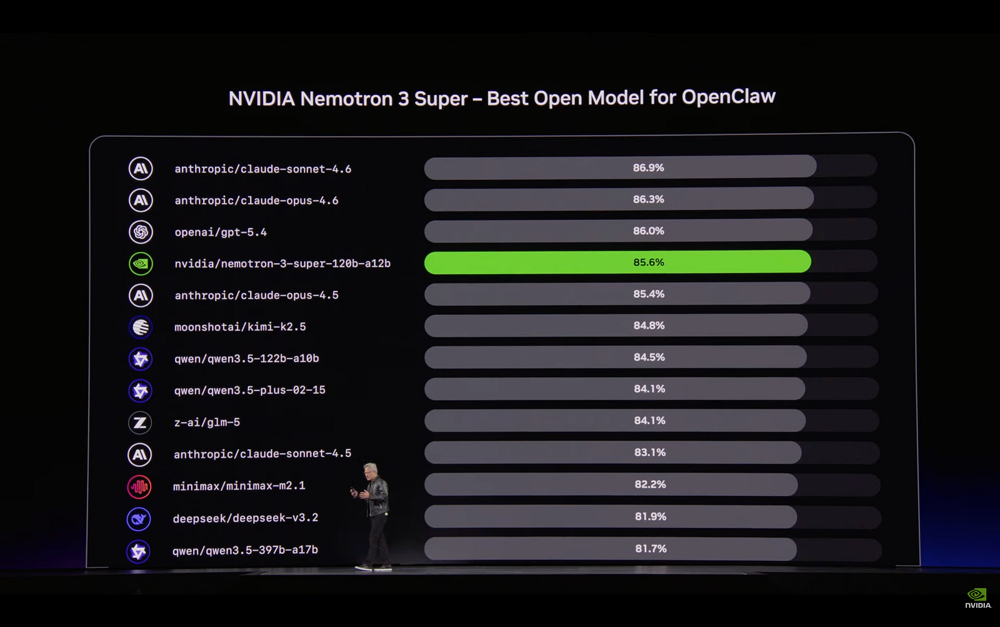
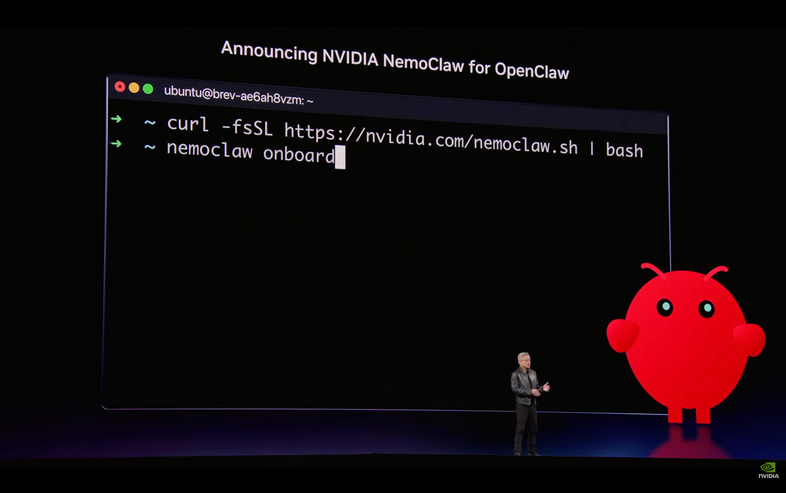

# NVIDIA NemoClaw

## NemoClaw Is Not a Technical Breakthrough. It Is a Platform Capture Move.

NVIDIA took commodity Linux security primitives, wrapped them around the most viral open-source project of 2026, timed the announcement to GTC, and pre-signed enterprise partners on day one.

The technology is replicable.

The ecosystem play is not.



## The Setup

On 16 March 2026, Jensen Huang stood on stage at GTC in San Jose and said this about OpenClaw:

> Mac and Windows are the operating systems for the personal computer. OpenClaw is the operating system for personal AI.



In the same keynote, NVIDIA announced **NemoClaw**.

An open-source stack (Apache 2.0) that wraps OpenClaw inside NVIDIA's OpenShell secure runtime.

The pitch was simple.

OpenClaw is brilliant but dangerous.

NemoClaw makes it safe for the enterprise.

Two days later, 2,300+ GitHub stars. 265 forks. 154 open issues. Alpha-quality software with enterprise-grade marketing.

I forked it.

I swapped the default model from the 120B Nemotron to the 49B Nemotron Super v1.

It took six file changes.

That simplicity tells you something about where the real value lives... and it is not in the code.

## What NemoClaw actually is



NemoClaw is a plugin with four layers.



You install it with one command.

```
curl -fsSL https://nvidia.com/nemoclaw.sh | bash
```

The sandbox uses Landlock, seccomp and network namespaces.

Three Linux kernel security primitives that have existed for years.

The installer pulls the Nemotron model, creates an isolated container and applies declarative YAML security policies.

The agent runs inside.

Every network request, file access and model call is governed by policy.

> The key architectural decision is out-of-process policy enforcement.

The guardrails live outside the agent process.

The agent cannot override them, even if compromised.

This is fundamentally different from prompt-based guardrails where the agent can reason its way around the constraints.

The **Privacy Router** adds another layer.

It routes sensitive context to local open models first and only sends data to frontier models like Claude when policy permits.

> The routing decision is made by the harness, not by the agent.

Static policies (filesystem, process) are locked at sandbox creation.

Dynamic policies (network, inference) can be hot-reloaded on a running sandbox.

When the agent tries to reach an unlisted host, OpenShell blocks it and surfaces the request in the TUI for human approval.

This is genuinely good architecture.

But none of it is new, as such.

## The timeline is almost too perfect



Follow the chronology.

**Late January 2026**, OpenClaw goes viral.

Jensen Huang later calls it "the fastest-growing open source project in history," surpassing what Linux achieved over 30 years in just a few weeks.

**February 2026**, the security backlash hits hard.

The first comprehensive audit by Koi Security researcher Oren Yomtov examined all 2,857 skills on ClawHub and found 341 malicious entries.

Of those, 335 belonged to a single coordinated campaign dubbed ClawHavoc targeting both macOS and Windows.

SecurityScorecard's STRIKE team identified over 135,000 unique IPs running exposed OpenClaw instances across 82 countries, with 12,812 exploitable via remote code execution.

**14 February 2026**, Peter Steinberger, OpenClaw's creator, announces he is joining OpenAI.

Sam Altman calls him "a genius with a lot of amazing ideas about the future of very smart agents."

OpenClaw moves to a foundation.

Governance vacuum opens.

**March 2026**, China's National Computer Network Emergency Response Technical Team warns that OpenClaw has "extremely weak default security configuration."

Government agencies and state-owned enterprises receive notices warning against installing OpenClaw on office devices.

The People's Bank of China adds a separate warning for the financial sector.

**16 March 2026**, NVIDIA ships NemoClaw at GTC. Kari Briski, VP for Generative AI Software, calls OpenClaw "likely the single most important software release in history."

Enterprise ISV partners including Adobe, Salesforce and SAP are announced on day one.

> NVIDIA did not invent the problem or the solution.

They waited for OpenClaw to go viral.

They waited for the security backlash to peak.

They waited for the creator to leave.

Then they shipped the enterprise-grade wrapper at their biggest annual event.

Classic platform capture playbook.

## Could it be replicated?



The technology, absolutely yes.

Competitors already exist and some of them launched weeks before NemoClaw.

But NemoClaw's entire security model, Landlock, seccomp, network namespaces, declarative YAML policies, is built on well-understood Linux kernel primitives.

Any team with Linux systems engineering experience can replicate the sandbox layer.

My fork proves the point.

I swapped the default model from the 120B Nemotron to the 49B Nemotron Super v1 across the blueprint, plugin source, onboarding and setup scripts.

Six files.

The 49B model needs only 24GB VRAM vs 40GB for the 120B, making it runnable on consumer GPUs and DGX Spark while maintaining strong agentic performance.

The code is not the moat.

## The real moat is ecosystem



### And critical mass

> What cannot be replicated is the distribution.

Enterprise ISV partners announced on day one, with Adobe, Salesforce and SAP among them.

Pre-installation on Dell's GB300 Desktop, the first machine to ship with NemoClaw and OpenShell out of the box.

Nemotron models optimised specifically for agentic workloads inside the runtime.

NVIDIA's brand trust, people will choose "NVIDIA-hardened OpenClaw" over any GitHub fork every time.

The strategic play is clear.

> NVIDIA is positioning itself as the infrastructure layer for autonomous AI Agents.

Not just the chip vendor.

Not just the model provider.

> The full stack from silicon to sandbox.

---

*Chief AI Evangelist @ Kore.ai | I'm passionate about exploring the intersection of AI and language. From Language Models, AI Agents to Agentic Applications, Development Frameworks & Data-Centric Productivity Tools, I share insights and ideas on how these technologies are shaping the future.*
